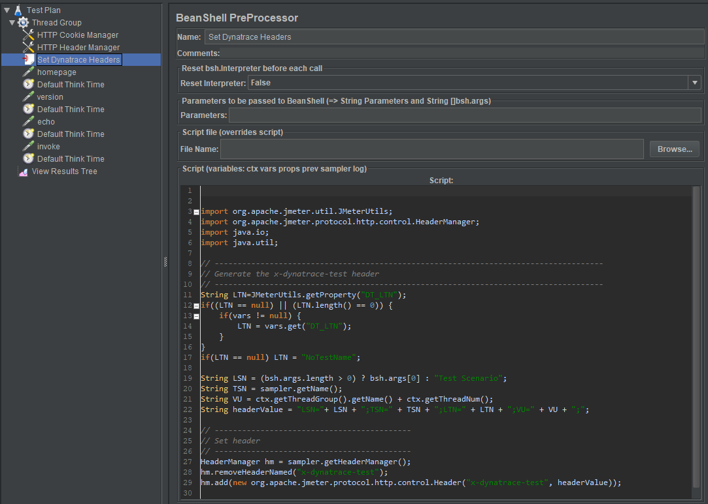

# JMeter Service

The *jmeter-service* has been updated with the implementation from the Keptn-Contrib project [jmeter-extended-service](https://github.com/keptn-contrib/jmeter-extended-service). This service provides extended capabilities around custom workload definitions and executions.

## Installation

The *jmeter-service* is part of the *Execution Plane for Continuous Delivery*.

You can find installation instructions [here](https://keptn.sh/docs/0.8.x/operate/install/#install-keptn).

To install it next to your Keptn installation, you can use the following command:

```console
helm install jmeter-service https://github.com/keptn/keptn/releases/download/0.8.4/jmeter-service-0.8.4.tgz -n keptn
```

## Development

You can use `skaffold run --tail` to build and deploy from this directory.


## Usage

The JMeter service expects JMeter test files in the project specific Keptn repo. It expects those files to be available in the jmeter subfolder for a service in the stage you want to execute tests.

Here is an example on how to upload the `basiccheck.jmx` test file via the Keptn CLI to the dev stage of project sockshop for the service carts:

```
keptn add-resource --project=sockshop --stage=dev --service=carts --resource=jmeter/basiccheck.jmx --resourceUri=jmeter/basiccheck.jmx
```

### Workloads

When the JMeter service is handling the `sh.keptn.events.deployment-finished` event it will execute different tests with different workload parameters depending on the test strategy.

Following is a table that shows you which tests are executed and which parameters are passed to the JMeter script. You notice that independent of the test strategy the JMeter service will always first execute the `basiccheck.jmx` if it exists. The basiccheck is there to make sure the service is even available and not returning any errors. This is like a quick health check by running the script and making sure there is a 0% failure rate.

If that basiccheck fails the main `load.jmx` will not be executed as it does not make sense if the service is not healthy. If it succeeds, `load.jmx` will be executed. Here the accepted failure rate will also be validated and based on that the JMeter service either returns pass or fail in the result value back to Keptn as part of the tests.finished event

| Test Strategy | Test Script     | VUCount | LoopCount | ThinkTime | Accepted Failure Rate |
| ------------- | -----------     | ------- | --------- | --------- | --------------------- |
| functional    | basiccheck.jmx  | 1       | 1         | 250       | 0 |
|               | load.jmx        | 1       | 1         | 250       | 0.1 |
| performance   | basiccheck.jmx  | 1       | 1         | 250       | 0 |
|               | load.jmx        | 10      | 500       | 250       | 0.1 |

These workload parameters including information about the service to be tested. Url and port are passed to the JMeter script as properties.

Here is an overview:

| Property Name | Description | Sample Value |
| ------------- | ----------- | ------------ |
| PROTOCOL      | Protocol    | https |
| SERVER_URL    | Value passed in deploymentURILocal or deploymentURIPublic | carts.staging.svc.local |
| CHECK_PATH    | This is meant for the basiccheck.jmx and defines the URL that should be used for the health check | /health |
| SERVER_PORT   | Port to be tested against | 8080 |
| DT_LTN        | A unique test execution name. To be used for integrations with tool such as Dynatrace | performance_123 |
| VUCount       | Virtual User Count | 10 |
| LoopCount     | Loop Count | 500 |
| ThinkTime     | Think Time | 250 |

If you look at the sample files that come with the Keptn tutorials, you will notice that the `basiccheck.jmx` and `load.jmx` leverage all these parameters. In the end,  it is up to you on whether you want to use these or hard code them into your jmx scripts.
Here a couple of screenshots from one of the JMeter files to see how these parameters can be used in your script:




### Custom Workloads

Since the first implementation of the JMeter-Service, we have got requests of making the workloads easier configurable. Instead of the hard coded VUser, LoopCount, etc. the request came in to configure this through a configuration file stored along with the test scripts.

A second request was around *Performance Testing as a Self-Service* where users wanted to have more than just one performance testing workload. You often want to just run a test with 10 users, then one with 50, and then with 100. Instead of changing these values in the JMX file before each run, users demanded to specify these settings as custom workloads which should be executable via Keptn.

If you want to overwrite the defaults or define your own custom workloads, you can do this by storing a `jmeter.conf.yaml` file in the same jmeter subfolder next to your scripts. Here is an example of such a file:

```
---
spec_version: '0.1.0'
workloads:
  - teststrategy: performance
    vuser: 100
    loopcount: 10
    script: jmeter/load.jmx
    acceptederrorrate: 1.0
  - teststrategy: performance_light
    vuser: 50
    loopcount: 10
    script: jmeter/load.jmx
    acceptederrorrate: 1.0
```

With this file, the defaults for the *performance* test strategy are overwritten. The file also defines a new workload for a new test strategy called *performance_light*. In order to make the JMeter service execute that workload, you have to specify that value when you send a configuration-change or deployment-finish event to Keptn. Here is an example:

```
{
  "contenttype": "application/json",
  "data": {
    "deploymentURIPublic": "http://simplenode.simpleproject-staging.keptn06-agrabner.demo.keptn.sh",
    "project": "sockshop",
    "service": "carts",
    "stage": "dev",
    "testStrategy" : "performance_light",
    "labels": {
        "user" : "grabnerandi"
    }
  },
  "source": "performance-service",
  "specversion": "0.2",
  "type": "sh.keptn.events.deployment-finished"
}
```

This now gives you a lot of flexibility when implementing "*Performance Testing as a Self-Service*". If you want to learn more also check out the tutorial on this topic: https://github.com/keptn-sandbox/performance-testing-as-selfservice-tutorial
